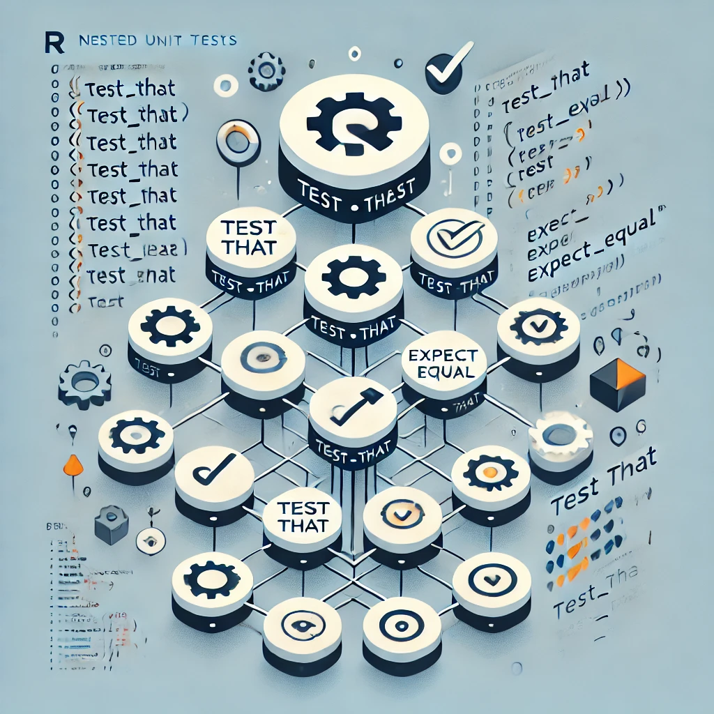

```{r setup, include=FALSE}
knitr::opts_chunk$set(echo = TRUE)
```

```{r out.width = '40%', echo = FALSE}

```

## Grouping unit tests by function

Say we have a function `add` that adds two numbers.

```{r}
add <- function(a, b) {
    stopifnot(
        is.numeric(a),
        is.numeric(b)
    )
    a + b
}
```

Our unit tests for this function could look like this:

```{r, eval = FALSE}
require(testthat)

test_that("add works as expected", {
  expect_equal(add(1, 2), 3)
})

test_that("add signals bad input types", {
    expect_error(add("1", 2), "is.numeric(a) is not TRUE", fixed = TRUE)
    expect_error(add(1, "2"), "is.numeric(b) is not TRUE", fixed = TRUE)
})
```

Naturally, we want to group these tests by the function they test, which can
be done as follows:

```{r, eval = FALSE}
test_that("add", {

    expect_true(exists("add"))  # prevent "empty test" notification

    test_that("works as expected", {
        expect_equal(add(1, 2), 3)
    })

    test_that("signals bad input types", {
        expect_error(add("1", 2), "is.numeric(a) is not TRUE", fixed = TRUE)
        expect_error(add(1, "2"), "is.numeric(b) is not TRUE", fixed = TRUE)
    })
})
```

We now have all tests related to the `add` function grouped nicely together.
Note that we added one test at the top to prevent the "empty test" notification
that `testthat` would otherwise give us when running the entire block
as part of a test suite.

Grouping your tests this way becomes increasingly attractive when working on
larger projects. It will make it a lot easier to find the tests you are
looking for and to move around blocks of tests for specific functions.
It also allows to quickly skip all tests in case your code breaks and you
need to revise your function:

```{r, eval = FALSE}
test_that("add", {

    expect_true(exists("add"))  # prevent "empty test" notification

    skip("for now - need to revise function")   # <- skip all tests

    test_that("works as expected", {
        expect_equal(add(1, 2), 3)
    })

    test_that("signals bad input types", {
        expect_error(add("1", 2), "is.numeric(a) is not TRUE", fixed = TRUE)
        expect_error(add(1, "2"), "is.numeric(b) is not TRUE", fixed = TRUE)
    })
})
```


### Shortcut notation for tested functions

The block-like structure allows to take the testing one step further by
always using a shortcut notation for the function being tested:

```{r, eval = FALSE}
test_that("add", {

    f <- add
    expect_true(is.function(f))

    test_that("works as expected", {
        expect_equal(f(1, 2), 3)
    })

    test_that("signals bad input types", {
        expect_error(f("1", 2), "is.numeric(a) is not TRUE", fixed = TRUE)
        expect_error(f(1, "2"), "is.numeric(b) is not TRUE", fixed = TRUE)
    })
})
```

This approach has several advantages as it makes it easier to

- spot your function when searching across files
- rename the function in the entire code base
- write compact test code when the function name is long
- re-use tests for similar functions

### Local scoping

Another advantage of grouped unit tests is that it allows for re-using
variables or test data while keeping them local to the test block.

```{r, eval = FALSE}
test_that("add", {

    f <- add
    expect_true(is.function(f))

    a <- 1
    b <- 2
    sum <- a + b

    test_that("works as expected", {
        expect_equal(f(a, b), sum)
    })

    test_that("works with negative numbers", {
        expect_equal(f(-a, -b), -sum)
    })

    test_that("signals bad input types", {
        expect_error(f("a", b), "is.numeric(a) is not TRUE", fixed = TRUE)
        expect_error(f(a, "b"), "is.numeric(b) is not TRUE", fixed = TRUE)
    })
})
```


## Grouping unit tests by other criteria

Of course, you can group your tests by any criteria you like. For example,
you could group them by the type of test, the expected outcome, or the
input data. As a default, I would recommend grouping by function, and then
add additional test blocks as needed. A common scenario occurs when you
are performing regression tests, for example:

```{r, eval = FALSE}
test_that("add function matches reference results", {

    f <- add
    expect_true(is.function(f))

    test_that("matches reference for positive numbers", {
        a <- 1
        b <- 2
        ref <- 3
        expect_equal(f(a, b), ref)
    })

    test_that("matches reference for negative numbers", {
        a <- -1
        b <- -2
        ref <- -3
        expect_equal(f(a, b), ref)
    })
})
```


### Summary

In Summary, I recommend to *always* group your unit tests at least by function
as this will make your test suite much more readable and maintainable. Once
you get used to this structure, you will find even more ways to organize
your test suite.

Let me know in the comments if you found this post helpful or if you
have any additional tips on this topic.
