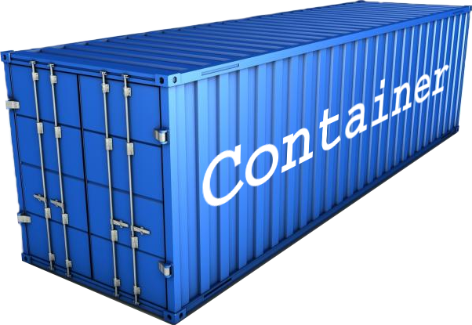

```{r setup, include=FALSE}
knitr::opts_chunk$set(echo = TRUE)
library(container)
```


### What is `container`?

<div>
A container can be considered an enhanced version of base R's list with a 
carefully designed set of extract, replace, and remove operations that make it 
easier and safer to work with list-like data structures, be it in interactive R
sessions or especially when developing critical code or packages.
</div>

<aside>
```{r out.width = '100%', echo = FALSE}

```

</aside>

This blog post can only provide a glimpse of all the things you can do with
containers so here we focus on some features suitable for
*interactive* R sessions.


```{r panelset, echo=FALSE, include=FALSE}
xaringanExtra::use_panelset()
xaringanExtra::style_panelset_tabs(font_family = "inherit")
```


### Print

```{r}
library(container)

co <- container(colors = c("Red", "Green", "Blue"),
                numbers = 1:10,
                data = cars[1:10, ])
```


Let's start by comparing the print output of container and list
(click on the panels below).

::::: {.panelset}

::: {.panel}

### container {.container-out}

```{r}
print(co)
```
:::

::: {.panel}

### list {.list-out}

```{r}
li = as.list(co)
print(li)
```

:::

:::::

As you see the container by default prints very compact. Next, take a look
at data extraction.


### Extract

A container provides all familiar extract operations known from base 
R list, but also some new operations to make life (hopefully) easier. 
Also note that in contrast to base R list,
undefined indices are ignored and thus don't produce `NULL` values. 

::::: {.panelset}

::: {.panel}

### container {.container-out}

```{r}
co[[1]]                  # standard
co[2:3]                  # standard
co[c(1:2, 5:8)]          # ignore undefined indices
co[1, 2, 5:8]            # pass any number of indices - same as before
co[1, "data", 2, "foo"]  # index types can be mixed
```
:::

::: {.panel}

### list {.list-out}

```{r, error = TRUE}
li[[1]]                  # standard
li[2:3]                  # standard
li[c(1:2, 5:8)]          # pad NULLs for undefined indices
li[1, 2, 5:8]            # not supported
li[1, "data", 2, "foo"]  # not supported
```

:::

:::::

### Replace

Similarly, a container provides both standard and new 
ways for interactive element replacement.

::::: {.panelset}

::: {.panel}

### container {.container-out}

```{r}
co[2:3] <- NA                                # standard
co

co[[1]] <- ""                                # standard
co

co[["colors"]] <- "red"                      # standard
co

co[list("colors", 2)] <- list("blue", 1:4)   # mixed indices
co

co[[{"blue"}]] <- "green"                    # replace by value
co

co[[{NA}]] <- 0                              # replace by value
co
```
:::

::: {.panel}

### list {.list-out}

```{r, error = TRUE}
li[2:3] <- NA                                # standard
li

li[[1]] <- ""                                # standard
li

li[["colors"]] <- "red"                      # standard
co

li[list("colors", 2)] <- list("blue", 1:4)   # not supported

#li[[{"blue"}]] <- "green"                   # not supported

#li[[{NA}]] <- 0                             # not supported
```

:::

:::::


To see the full official documentation, please visit
[https://rpahl.github.io/container/](https://rpahl.github.io/container/index.html). 
