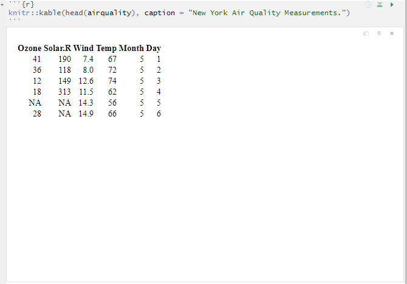
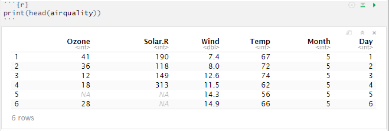
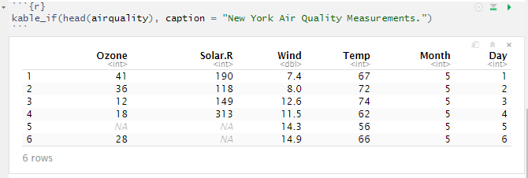

## The setup
The [RStudio](https://rstudio.com/) notebook is a great interactive tool to 
build a statistical report. Being able to see statistics and graphs right on 
the fly probably has saved me countless hours, especially when building complex 
reports.

However, one thing that has always bothered me was the way tables are displayed 
in the notebook with [knitr](https://CRAN.R-project.org/package=knitr)'s 
`kable` function. For example, consider the `airquality` data set:

```{r}
head(airquality)
```

To get a nice table in your report you type

```{r, eval = FALSE}
knitr::kable(head(airquality), caption = "New York Air Quality Measurements.")
```

which shows up nicely formatted in the final output

```{r, echo = FALSE}
knitr::kable(head(airquality), caption = "New York Air Quality Measurements.")
```

<br>

## The problem
*But* in the interactive RStudio notebook session the table looks something like the following:

```{r out.width = '100%', echo = FALSE, eval = TRUE}

```

So first of all, the formatting is not that great. Secondly, the table chunk consumes way too much space of the notebook and, at times, can be very cumbersome to scroll. Also for bigger tables (and depending on your hardware) it can take up to a few seconds for the table to be built. 

So often when I was using `kable`, I felt my workflow being disrupted. In the interactive session I want a table being built quickly and in a clean format. Now, using the simple `print` function you'll get exactly this

```{r out.width = '100%', echo = FALSE, eval = TRUE}

```

So my initial quick-and-dirty workaround during the interactive session was to comment out the `knitr` statement and use the print function.

```{r, echo = TRUE, eval = FALSE}
#knitr::kable(head(airquality), caption = "New York Air Quality Measurements.")
print(head(airquality))
```

Then, only when creating the final report, I would comment out the `print` function and use `kable` again. Of course, there is a much more elegant and easier solution to get this without having to switch between functions. 

## The solution
We define a simple wrapper, which chooses the corresponding function depending on the context:

```{r}
kable_if <- function(x, ...) if (interactive()) print(x, ...) else knitr::kable(x, ...)
```

Then you simply call it as you would invoke `kable` and now you get both, the quick table in the interactive session ...

```{r out.width = '100%', echo = FALSE, eval = TRUE}

```

... and a formatted table in the report.

```{r}
kable_if(head(airquality), caption = "New York Air Quality Measurements.")
```

That's it. Simply put this function definition somewhere in the top of your document and enjoy a quick workflow.
