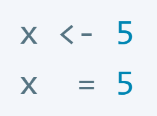

```{r setup, include = FALSE, message = FALSE, cache = FALSE}
# Setup
knitr::opts_chunk$set(eval = FALSE, warning = FALSE, tidy = FALSE)
```


```{r out.width = '20%', echo = FALSE, eval = TRUE}

```


# Introduction {#intro}

There are universal views about readability due to the way how humans process
information or text. For example, consider the following number
written in two ways:

```{r, echo=TRUE, eval=FALSE}
823969346
823 969 346
```

Certainly the second version, which splits the sequence into groups of numbers,
is easier to process by humans, implying that spacing is important especially
if abstract information is presented.

The style guide at hand provides a set of rules designed to achieve readable
and maintainable R code. Still, of course, it represents a
subjective view (of the author) on how to achieve these goals and does not
raise any claims of being complete. Thus, if there are viable alternatives to
the presented rules or if they are against the intuition of the user, possibly
even resulting in hard-to-read code, it is better to deviate from the rules
rather than blindly following them.

# Coding style  {#style}

## Notation and naming {#notation}

### File names

File names end in .R and are meaningful about their content:

**Good:**

* string-algorithms.R
* utility-functions.R


**Bad:**

* foo.R
* foo.Rcode
* stuff.R

### Function names  
Preferrably function names consist of lowercase words separated by an underscore.
Using dot (.) separator is avoided as this confuses with the use of generic
([S3](http://adv-r.had.co.nz/S3.html)) functions. It also prevents name clashes
with existing functions from the standard R packages.
Camel-case style is also suitable especially for predicate functions returning
a boolean value. Function names ideally start with *verbs* and describe what the
function does.

```{r}
# GOOD
create_summary()
calculate_avg_clicks()
find_string()
isOdd()

# BAD
crt_smmry()
find.string()
foo()
```

### Variable names
Variable names consist of lowercase words separated by an underscore or dot.
Camel-case style is also suitable especially for variables representing boolean
values. Variable names ideally are attributed *nouns* and describe what (state)
they store.

**Good:**

```{r}
summary_tab
selected_timeframe
out.table
hasConverged
```

**Bad:**

```{r}
smrytab
selTF
outtab
hascnvrgd
```

Name clashes with existing R base functions must be avoided:

```{r}
# Very bad:
T <- FALSE
c <- 10
mean <- function(a, b) (a + b) / 2
file.path <- "~/Downloads" # clashes with base::file.path
```

Loop variables or function arguments can be just single letters if

* the naming follows standard conventions
* their meaning is clear
* understanding is preserved

otherwise use longer variable names.

```{r}
# GOOD
for (i in 1:10) print(i)
add <- function(a, b) a + b
rnorm <- function(n, mean = 0, sd = 1)

# BAD
for (unnecessary_long_variable_name in 1:10) print(unnecessary_long_variable_name)
add <- function(a1, x7) a1 + x7
rnorm <- function(m, n = 0, o = 1)
```

### Function definitions 
Function definitions first list arguments without default values,
followed by those with default values.
In both function definitions and function calls, multiple arguments per line
are allowed; line breaks are only allowed between assignments.

```{r}
# GOOD
rnorm <- function(n, mean=0, sd=1)
pnorm <- function(q, mean=0, sd=1, 
                  lower.tail=TRUE,
                  log.p=FALSE)

# BAD
mean <- function(mean=0, sd=1, n)           # n should be listed first
pnorm <- function(q, mean=0, sd=1, lower.tail=
                  TRUE, log.p=FALSE)
```

### Function calls
When calling a function, the meaning of the function call and arguments should 
be clear from the call, that is, usually function arguments beyond the first 
are explicitly named or at least invoked with a meaningful variable name, for
example, identical to the name of the function argument:

```{r}
# GOOD
rnorm(1, mean=1, sd=2)
identical(1, 1.0)   # no need for explicit naming as meaning of call is clear

mean <- 1
sd <- 2
std.dev <- sd
rnorm(1, mean, sd)
rnorm(1, mean, std.dev)

# BAD
rnorm(1, 1, 1)
```


### Number of function arguments

Try to limit the number of function arguments to around five. No human being
is able to remember much more than this. If needed, group semantically similar
arguments in lists or (even better) in functions returning a list. 
If you have a hard time doing this, you should think about
how to split up your function as it probably does too many things.

```{r}
# GOOD
my_plot <- function(x, y, 
                   colors = list(bg = "red", fg = "green", line = "black"),
                   linetype = list(main = 1, limit = 2, circle = 3))
{ ... }

# Even better
plot_colors <- function(bg = "red", fg = "green", line = "black") {
    list(bg = bg, fg = fg, line = line)
}

plot_linetypes <- function(main = 1, limit = 2, circle = 3) {
    list(main = main, limit = limit, circle = circle)
}

my_plot <- function(x, y, colors = plot_colors(), linetype = plot_linetypes()) { ... }


# BAD
my_plot <- function(x, y, 
                   color.bg = "red", color.fg = "green", color.line = "black",
                   linetype.main = 1, linetype.limit = 2, linetype.circle = 3)
{ ... }

# Even worse
my_plot <- function(x, y, cl.bg = "red", cl.fg = "green", cl.l = "black",
                    lt.m = 1, lt.l = 2, lt.c = 3)
{ ... }

# Very bad
my_fit_and_plot <- function(formula, data, sub, w, na.action, method,
                            x, y, cl.bg = "red", cl.fg = "green",
                            cl.l = "black", lt.m = 1, lt.l = 2, lt.c = 3)
```


## Syntax {#syntax}
### Assignment
For assignment, both the arrow `<-` and equal sign `=` can be used. However,
try to be consistent throughout.

Semicolons should **never** used.

```{r}
# BAD
x <- 5; y <- 10; z <- 3  # break into three lines instead
```


### Spacing around ...
#### ... commas
Place a space after a comma but never before (as in regular English)

```{r}
# GOOD
v <- c(1, 2, 3)
m[1, 2]

# BAD
v <- c(1,2,3)
m[1 ,2]
```


#### ... operators
Spaces around infix operators (`=`, `+`, `-`, `<-`, etc.) should be done in a way that
supports readability, for example, by placing spaces between semantically
connected groups. If in doubt, rather use more spaces, except with colons `:`,
which usually should **not** be surrounded by spaces.

```{r}
# GOOD
# Spacing according to semantically connected groups
x <- 1:10
base::get
average <- mean(feet/12 + inches, na.rm=TRUE)

# Using more spaces - also ok
average <- mean(feet / 12 + inches, na.rm = TRUE)
```

```{r}
# BAD
x <- 1 : 10
base :: get
average<-mean(feet/12+inches,na.rm=TRUE)


```

#### ... parentheses
A space is placed before left parentheses, except in a function call,
and after right parentheses. Arithmetic expressions form a special case,
in which spaces can be omitted.

```{r}
# GOOD
if (debug) print(x)
plot(x, y)

# Special case arithmetic expression:
2 + (a+b)/(c+d) + z/(1+a)

# BAD
if(debug)print (x)
plot (x, y)
```

No spaces are placed around code in parentheses or square brackets,
unless there is a comma:

```{r}
# GOOD
if (debug) print(x)
diamonds[3, ]
diamonds[, 4]

# BAD
if ( debug ) print( x )
diamonds[ ,4]
```

#### ... curly braces
An opening curly brace is followed by a new line.
A closing curly brace goes on its own line.

```{r}
# GOOD
for (x in letters[1:10]) {
    print(x)
}

add <- function(x, y) {
    x + y
}

add <- function(x, y)
{
    x + y
}

# BAD
add <- function(x, y) {x + y}
```

### Indentation
Code is indented with *ideally four*, but *at least two* spaces. Usually using
four spaces provides better readability than two spaces especially the longer
the indented code-block gets.

```{r}
# Four-space indent:
for (i in seq_len(10)) {
    if (i %% 2 == 0) {
        print("even")
    } else {
        print("odd")
    }
}

# The same code-block using two-space indent:
for (i in seq_len(10)) {
  if (i %% 2 == 0) {
    print("even")
  } else {
    print("odd")
  }
}
```


Extended indentation: when a line break occurs inside parentheses,
align the wrapped line with the first character inside the parenthesis:

```{r}
fibonacci <- c(1, 1, 2, 3, 5,
               8, 13, 21, 34)
```


## Code organization {#organization}
As with a good syntax style, the main goal of good code organization is to
provide good readability and understanding of the code, especially for
external readers/reviewers. While the following guidelines generally have
proven to be effective for this purpose, they harm things if applied the
wrong way or in isolation. For example, if the user wants to restricts himself
to 50 lines of code for each block (see below), but, instead of proper
code-reorganization, achieves this by just deleting all comments in the code
block, things probably have gotten worse.
Thus, *any (re-)organization of code first and foremost must serve the
improvement of the readability and understanding of the code*, ideally
implemented by the guidelines given in this section.

### Line length
Ideally, the code does **not** exceed *80 characters per line*. This fits
comfortably on a printed page with a reasonably sized font and therefore can be
easily processed by a human, which tend to read line by line. Longer comments
are simply broken into several lines:

```{r}
# Here is an example of a longer comment, which is just broken into two lines
# in order to serve the 80 character rule.
```

Long variable names can cause problems regarding the 80 characters limit.
In such cases, one simple yet effective solution is to use interim results,
which are saved in a new meaningful variable name. This at the same time often
improves the readability of the code. For example:

```{r}
# Longer statement
total_cost <- cost.hotel + cost.taxi + cost.lunch + cost.airplane +
    cost.breakfast + cost.dinner + cost.car_rental

# Solution with interim result
cost.travel <- cost.taxi + cost.airplane + cost.car_rental
cost.food <- cost.breakfast + cost.lunch + cost.dinner
total_cost <- cost.travel + cost.food + cost.hotel
```

Similarly, four-space indenting in combination with multiple nested code-blocks
can cause problems to maintain the 80 character limit and may require to relax 
this rule in such cases. At the same time, however, multiple nested code-blocks 
should be avoided in the first place, because with more nesting the code usually 
gets harder to understand.


### Block length
Each functionally connected block of code (usually a function block) should
**not** exceed a single screen (about 50 lines of code).
This allows the code to be read and understood without having to line-scroll.
Exceeding this limit usually is a good indication that some of the code
should be encapsulated (refactorized) into a separate unit or function.
Doing so, not only improves the readability of the code but also flexibilizes
(and thereby simplifies) further code development. In particular,
single blocks that are separated by comments, often can be refactorized into
functions, named similar to the comment, for example:

**Long single-block version:**

```{r}
# Sub-block 1: simulate data for some model
x <- 1:100
y <- rnorm(length(x))
.
.
.
longer code block generating some data
.
.
.
data <- ...

# Sub-block 2: plot the resulting data points
ylims <- c(0, 30)
p <- ggplot(data) +
.
.
.
longer code block defining plot object
.
.
.

# Sub-block 3: format results and export to Excel file
outFile <- "output.xlsx"
.
.
export to Excel file
.
.
```

The singe-block version may exceed a single page and requires a lot of comments
just to separate each step visually, but even with this visual separation, it
will be unnecessary difficult for a second person to understand the code,
because allthough the code might be entirely sequential, he possibly will end
up jumping back and forth within the block to get an understanding of it.
In addition, if parts of the block are changed at a later time point,
the code can easily get out of sync with the comments.

**Refactorized version:**

```{r}
# Simulate data, plot it and export it to Excel file
data.sim <- simulate_data(x = 1:100, y = rnorm(length(x)), ...)
plot_simulated_data(data.sim, ylims = c(0, 30), ...)
write_results_into_table(data.sim, outFile="output.xlsx")
```

In the refactorized version each sub-block was put into a separate function.
In contrast to the single-block
version, each of these functions can be re-used, tested and have their own
documentation. Since each of such functions encapsulate their own environment,
the refactorized design is also less vulnerable to side-effects
between blocks. A second person can now read and understand function by
function without having to worry about the rest of the block.

Last but not least, the block comments in the single-block versions
could be transformed into function names so that the documentation is now
part of the code and as such no longer can get out of sync with it.


### Packages and namespaces
Whenever the `::` operator is used, the namespace of the corresponding package is
loaded but not attached to the search path.

```{r, eval=TRUE, error=TRUE}
tools::file_ext("test.txt")     # loads the namespace of the 'tools' package,
search()                        # but does not attach it to the search path
file_ext("test.txt")            # and thus produces an error if called without namespace prefix

# base::mean and stats::rnorm work, because base and stats namespaces are
# loaded and attached by default:
mean(rnorm(10))
```

In contrast, the `library` and `require` commands both load the package's
namespace but also attach its namespace to the search path, which
allows to refer to functions of the package without using the `::` operator.

```{r, eval=TRUE}
library(tools)                  # loads namespace and attaches it to search path
search()
file_ext("test.txt")            # now works
```

Since a call to a function shall not alter the search path, `library` or 
`require` statements are not allowed in functions used in R packages.
In contrast, `library` statements are suitable for local (data analysis) R 
scripts especially if a specific function is used frequently. 
An alternative is to locally re-map a frequently used function:

```{r, eval=TRUE}
get_file_extension <- tools::file_ext
get_file_extension("test.txt")
get_file_extension("test.docx")
get_file_extension("test.xlsx")
```


# Code documentation {#docu}
## Function headers
A function header is placed above any function, unless it is defined inside 
another function.

It is recommended to use the 
[roxygen](https://cran.r-project.org/web/packages/roxygen2) format, because it

* promotes a standardized documentation
* allows for automatic creation of a user-documentation from the header
* allows for automatic creation of all namespace definitions of an R-package 

A function header at least contains the following elements (the corresponding
roxygen keyword is listed at the start):

* @title: short sentence of what the function does
* @description: extended description of the function (optionally the @details 
  keyword can be used to describe further details)
* @param (or @field with RefClasses): For each input parameter, a summary of 
  the type of the parameter (e.g., string, numeric vector) and, if not obvious 
  from the name, what the parameter does.
* @return: describes the output from the function, if it returns something.
* @examples: if applicable, examples of function calls are provided. Providing 
  executable R code, which shows how to use the function in practice, is a 
  very important part of the documentation, because people usually look at the 
  examples first. While generally example code should work without errors, for 
  the purpose of illustration, it is often useful to also include code that 
  causes an error. If done, the corresponding place in the code should be marked
  accordingly (use \dontrun{} with roxygen).

Example of a roxygen-header:

```{r}
#' @title String suffix matching
#'
#' @description
#' Determines whether \code{end} is a suffix of string \code{s} (borrowed from
#' Python, where it would read \code{s.endswith(end)})
#'
#' @param s (character) the input character string
#' @param end (character) string to be checked whether it is a suffix of the
#' input string \code{s}.
#' @return \code{TRUE} if \code{end} is a suffix of \code{s} else \code{FALSE}
#'
#' @examples
#' string_ends_with("Hello World!", "World!")   # TRUE
#' string_ends_with(" Hello World!", "world!")  # FALSE (case sensitive)
string_ends_with <- function(s, end)
{
    # Implementation ...
}
```

## Inline code comments
Inline comments should explain the programmer's intent at a higher level of 
abstraction than the code, that is, they should provide additional information, 
which are not obvious from reading the code alone. As such, good comments 
don't repeat, summarize or explain the code, unless the code is so complicated 
that it warrants an explanation, in which case, however, it is often worth to 
revise the code to make it more readable instead. 

Examples of suitable, informative comments:

```{r}
# Compare strings pairwise and determine first position of differing characters
splitted_s <- strsplit(s, split = "")[[1]]
splitted_url <- strsplit(url, split = "")[[1]][1:nchar(s)]
different <- splitted_s != splitted_url
first_different_position <- which(different)[1]

# Provide index via names as we need them later
names(v) <- seq_along(v)
```

Bad redundant comments:

```{r}
v <- 1:10  # initialize vector

# Loop through all numbers in the vector and increment by one
for (i in 1:length(v)) {
    v[i] <- v[i] + 1  # increment number
}
```

That's it - happy coding!


