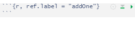

```{r out.width = '50%', echo = FALSE, eval = TRUE}

```

## Motivation

Consider you have defined variable `x`,

```{r}
x = 1
```

and define another chunk, where you simply add one up

```{r, echo = FALSE, comment=NA}
cat("```{r addOne}\nsum = x + 1\nsum\n```")
```
    

resulting in

```{r addOne, echo = FALSE}
sum = x + 1
sum
```

To reuse this chunk, an empty code block is created referencing the above chunk

```{r, echo = FALSE, comment=NA}
cat("```{r, ref.label = 'addOne'}\n```")
```


again resulting in

```{r, ref.label = "addOne"}
```

Behind the scenes, the chunk basically was copy-pasted and then executed again. One problem is that one can easily lose track of the scope of the variables used in that chunk. For example, let's assume you use the `sum` variable further below in your document to store some other result:

```{r}
sum = 10
```

If you now again reuse the above chunk

```{r, echo = FALSE, comment=NA}
cat("```{r, ref.label = 'addOne'}\n```")
```

```{r, ref.label = "addOne"}
```


`sum` has been overwritten by the chunk:

```{r}
print(sum)  # expect sum == 10
```

Since the `ref.label` chunk is empty, this issue might not be easily spotted.
 
Another inconvenience arrises with [RStudio](https://rstudio.com/)'s notebook functionality to execute individual code chunks. While the original chunk can be executed, none of the empty `ref.label` chunks can. Funnily enough, this inconvenience was what made me think about an alternative solution.

## Alternative solution
Luckily, the solution is quite simple - put your entire chunk inside a function and then "reference" the function:

```{r}
add1 <- function(x) {
    sum = x + 1
    sum
}
```


```{r}
add1(x)
```

Now both the `sum` variable is perfectly scoped and the "referenced" call can be executed in the RStudio notebook as usual. Plus, of course, this "chunk" could be easily parametrized:

```{r}
addY <- function(x, y) {
    sum = x + y
    sum
}
addY(x, y = 1)
```


## Summary {#summary}

Downsides of using `ref.label`:

* potential issues with (global) variables as chunk does *not* provide local scoping
* `ref.label` chunks are empty and therefore cannot be executed in RStudio notebooks

Proposed solution: encapsulate entire chunk inside a function and then execute the function wherever you would reference the chunk.


