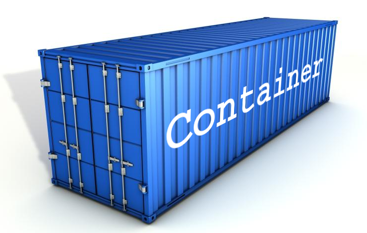
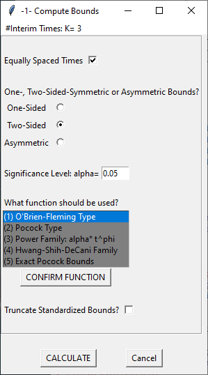

### container

<div>
[container](https://CRAN.R-project.org/package=container) 
provides an enhanced version of base R's `list` with a
carefully designed set of extract, replace, and remove operations that make
it easier and safer to work with list-like data structures.

Available on CRAN: https://CRAN.R-project.org/package=container.

Full documentation: https://rpahl.github.io/container/
</div>

<aside>
```{r out.width = '100%', echo = FALSE}

```
</aside>

### GroupSeq

<div>
[GroupSeq](https://CRAN.R-project.org/package=GroupSeq) is a GUI-based tool for 
computing probabilities of Group Sequential designs,
particularly, critical boundaries, power, drift, and confidence
intervals.

The numerical calculations are based on normally distributed
test statistics and the so-called alpha spending approach by Lan-DeMets with 
various alpha spending functions being available to choose among.

Available on CRAN: https://CRAN.R-project.org/package=GroupSeq
</div>

<aside>
```{r out.width = '100%', echo = FALSE}

```
</aside>


