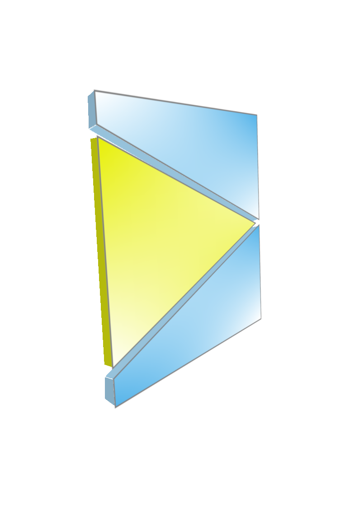

### container

[container](https://CRAN.R-project.org/package=container) 
provides an enhanced version of base R's `list` with a
carefully designed set of extract, replace, and remove operations that make
it easier and safer to work with list-like data structures.

Full documentation: https://rpahl.github.io/container/

<a href="https://CRAN.R-project.org/package=container" style="border:0">
<i class="fab fa-r-project" aria-hidden="true"></i>
</a>
<a href="https://github.com/rpahl/container" style="border:0">
<i class="fab fa-github" aria-hidden="true"></i>
</a>

<aside>

</aside>

### GroupSeq

[GroupSeq](https://CRAN.R-project.org/package=GroupSeq) is a GUI-based tool for 
computing probabilities of Group Sequential designs,
particularly, critical boundaries, power, drift, and confidence
intervals.

The numerical calculations are based on normally distributed
test statistics and the so-called alpha spending approach by Lan-DeMets with 
various alpha spending functions being available to choose among.

Full documentation: https://rpahl.github.io/GroupSeq/

<a href="https://CRAN.R-project.org/package=GroupSeq" style="border:0">
<i class="fab fa-r-project" aria-hidden="true"></i>
</a>
<a href="https://github.com/rpahl/GroupSeq" style="border:0">
<i class="fab fa-github" aria-hidden="true"></i>
</a>

<aside class = "centered">

</aside>

