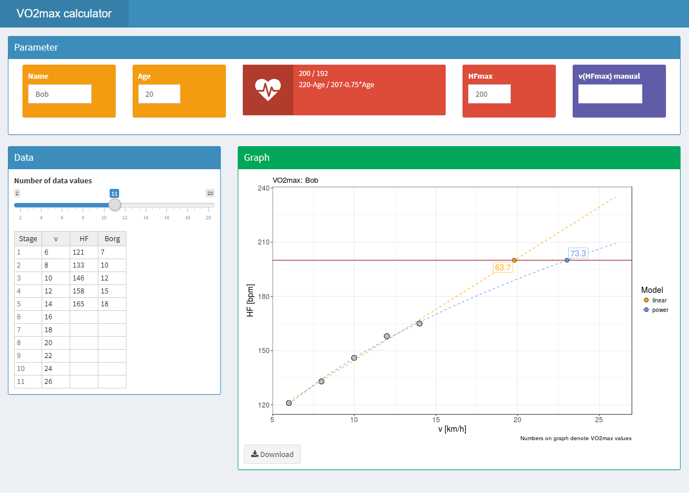
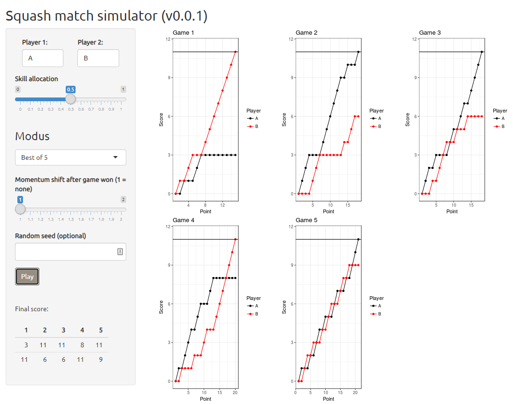

### VO2max

[vo2max](https://rpahl.shinyapps.io/vo2max/) allows to calculate VO2max based on 
a simple running experiment without having to actually going full max exhaustion,
which is especially viable when working with young athletes. Basically,
the athlete runs three-minute intervals on a treadmill with constant speed,
starting very low. At the end of each interval, the trainer
notes the heart frequency (HF) and the speed is increased. Due to the fact that 
VO2max more or less is linearly related to heart frequency and running speed,
the VO2max can be determined quite accurately with 5-6 data points without having
to reach max HF (although the max HF must be known and entered in the app).

### Squash match simulator

[squash-sim](https://rpahl.shinyapps.io/squash-sim/) simulates Squash matches
based on simple Bernoulli probabilities. The motivation was to develop an 
intuition about how much luck is involved in the game. For example, if both
players are equal in strength, it is not rare that a player wins 3-0.

<a href="
" style="border:0">
<i class="fab fa-github" aria-hidden="true"></i>
</a>

